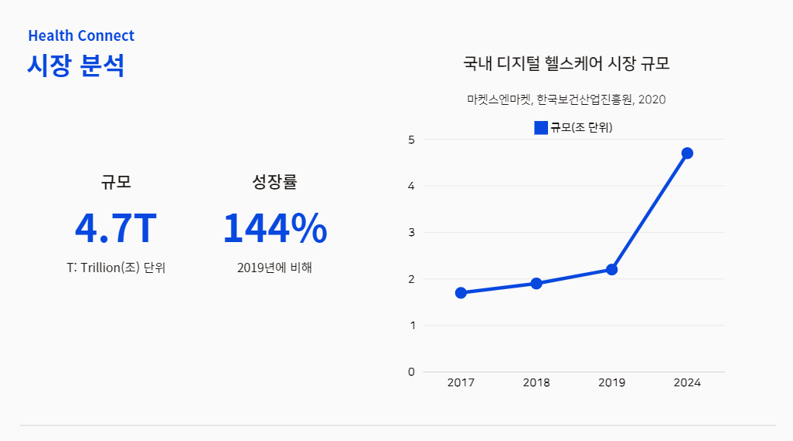

# 프로젝트 주제
건강 관리 커뮤니티 사이트

## 팀명 
HealthConnect

## 팀원
김동하(조장)[https://github.com/kdh0825kr]  
"조장 / 엔지니어 / 기획"
신수민[https://github.com/StarlightSSM]  
"엔지니어 / 기획 / 디자인"
안예빈[https://github.com/mewmaze]  
"엔지니어 / 기획 / 디자인 / 깃허브 관리" 

# 프로젝트 목적
사용자들에게 더 쉽게 정보를 접할 수 있도록 하고, 사용자들간 정보를 공유하며 커뮤니티를 통해 친목, 경쟁 등 힘든 운동을 더 의미있고 재미있게 접근, 지속할 수 있도록 함

## 덤벨 이코노미(Dumbbel-Economy)
 아령(Dumbbel)과 경제(Economy)의 합성어,
 운동, 다이어트 등 건강과 체력관리에 대한 소비가 증가하면서 관련 시장이 급격히 성장하는 경제 현상을 의미한다.
 소비의 주체인 MZ 세대(밀레니얼)에 의해 각광받게 되었다.
 홈트레이닝과 유사한 의미를 가지며, 최근 국내에서 주 52시간 근무제가 도입되면서 워라벨(삶과 일의 균형)의 확산으로 시장규모가 확대되었다.

## 시장조사

# 발표자료 링크
https://www.canva.com/design/DAGMkOO7ivo/18dDIfXf3oW7VAjJowhB1w/edit?utm_content=DAGMkOO7ivo&utm_campaign=designshare&utm_medium=link2&utm_source=sharebutton

 

# 실행하기 전 앞서서 해야할 것
## npm install (라이브러리 설치)
### 일부 필요한 리액트 라이브러리

    axios
    react-calendar
    react-router-dom

### mui, emotion 라이브러리

    @emotion/react
    @emotion/styled
    
    @mui/base/Tabs
    @mui/base/Tab
    @mui/base/TabsList
    @mui/base/TablePagination
    
    @mui/icons-material/FirstPageRounded
    @mui/icons-material/LastPageRounded
    @mui/icons-material/ChevronLeftRounded
    @mui/icons-material/ChevronRightRounded

    @mui/styled-engine
    @mui/system

    @mui/material

    styled-components

# Getting Started with Create React App

This project was bootstrapped with [Create React App](https://github.com/facebook/create-react-app).

## Available Scripts

In the project directory, you can run:

### `npm start`

Runs the app in the development mode.\
Open [http://localhost:3000](http://localhost:3000) to view it in your browser.

The page will reload when you make changes.\
You may also see any lint errors in the console.

### `npm test`

Launches the test runner in the interactive watch mode.\
See the section about [running tests](https://facebook.github.io/create-react-app/docs/running-tests) for more information.

### `npm run build`

Builds the app for production to the `build` folder.\
It correctly bundles React in production mode and optimizes the build for the best performance.

The build is minified and the filenames include the hashes.\
Your app is ready to be deployed!

See the section about [deployment](https://facebook.github.io/create-react-app/docs/deployment) for more information.

### `npm run eject`

**Note: this is a one-way operation. Once you `eject`, you can't go back!**

If you aren't satisfied with the build tool and configuration choices, you can `eject` at any time. This command will remove the single build dependency from your project.

Instead, it will copy all the configuration files and the transitive dependencies (webpack, Babel, ESLint, etc) right into your project so you have full control over them. All of the commands except `eject` will still work, but they will point to the copied scripts so you can tweak them. At this point you're on your own.

You don't have to ever use `eject`. The curated feature set is suitable for small and middle deployments, and you shouldn't feel obligated to use this feature. However we understand that this tool wouldn't be useful if you couldn't customize it when you are ready for it.

## Learn More

You can learn more in the [Create React App documentation](https://facebook.github.io/create-react-app/docs/getting-started).

To learn React, check out the [React documentation](https://reactjs.org/).

### Code Splitting

This section has moved here: [https://facebook.github.io/create-react-app/docs/code-splitting](https://facebook.github.io/create-react-app/docs/code-splitting)

### Analyzing the Bundle Size

This section has moved here: [https://facebook.github.io/create-react-app/docs/analyzing-the-bundle-size](https://facebook.github.io/create-react-app/docs/analyzing-the-bundle-size)

### Making a Progressive Web App

This section has moved here: [https://facebook.github.io/create-react-app/docs/making-a-progressive-web-app](https://facebook.github.io/create-react-app/docs/making-a-progressive-web-app)

### Advanced Configuration

This section has moved here: [https://facebook.github.io/create-react-app/docs/advanced-configuration](https://facebook.github.io/create-react-app/docs/advanced-configuration)

### Deployment

This section has moved here: [https://facebook.github.io/create-react-app/docs/deployment](https://facebook.github.io/create-react-app/docs/deployment)

### `npm run build` fails to minify

This section has moved here: [https://facebook.github.io/create-react-app/docs/troubleshooting#npm-run-build-fails-to-minify](https://facebook.github.io/create-react-app/docs/troubleshooting#npm-run-build-fails-to-minify)
